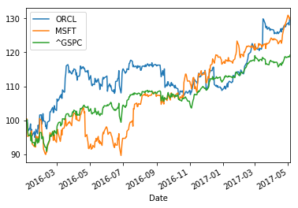
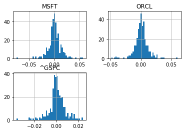

```python
import pandas as pd
import numpy as np
import datetime
from datetime import date
import matplotlib.pyplot as plt
import pandas_datareader.data as web
```


```python
symbols = ["ORCL","MSFT", "^GSPC"]
```


```python
data = pd.DataFrame()
```


```python
start = date(2016, 1, 1)
end = date.today()
```


```python
for ticker in symbols:
    data[ticker] = web.DataReader(ticker, 'yahoo', start, end)["Adj Close"]
```


```python
data.tail()
```


<div>
<table border="1" class="dataframe">
  <thead>
    <tr style="text-align: right;">
      <th></th>
      <th>ORCL</th>
      <th>MSFT</th>
      <th>^GSPC</th>
    </tr>
    <tr>
      <th>Date</th>
      <th></th>
      <th></th>
      <th></th>
    </tr>
  </thead>
  <tbody>
    <tr>
      <th>2017-05-01</th>
      <td>45.049999</td>
      <td>69.410004</td>
      <td>2388.330078</td>
    </tr>
    <tr>
      <th>2017-05-02</th>
      <td>45.130001</td>
      <td>69.300003</td>
      <td>2391.169922</td>
    </tr>
    <tr>
      <th>2017-05-03</th>
      <td>44.889999</td>
      <td>69.080002</td>
      <td>2388.129883</td>
    </tr>
    <tr>
      <th>2017-05-04</th>
      <td>45.470001</td>
      <td>68.809998</td>
      <td>2389.520020</td>
    </tr>
    <tr>
      <th>2017-05-05</th>
      <td>45.580002</td>
      <td>69.000000</td>
      <td>2399.290039</td>
    </tr>
  </tbody>
</table>
</div>


```python
#We use 100 as a starting value
#Using ix as a primarily label-location based indexer
(data/data.ix[0] * 100).plot()
plt.show()
```





```python
#Calculating log returns
log_returns = np.log(data/data.shift(1))
log_returns.tail()
```


<div>
<table border="1" class="dataframe">
  <thead>
    <tr style="text-align: right;">
      <th></th>
      <th>ORCL</th>
      <th>MSFT</th>
      <th>^GSPC</th>
    </tr>
    <tr>
      <th>Date</th>
      <th></th>
      <th></th>
      <th></th>
    </tr>
  </thead>
  <tbody>
    <tr>
      <th>2017-05-01</th>
      <td>0.002000</td>
      <td>0.013781</td>
      <td>0.001731</td>
    </tr>
    <tr>
      <th>2017-05-02</th>
      <td>0.001774</td>
      <td>-0.001586</td>
      <td>0.001188</td>
    </tr>
    <tr>
      <th>2017-05-03</th>
      <td>-0.005332</td>
      <td>-0.003180</td>
      <td>-0.001272</td>
    </tr>
    <tr>
      <th>2017-05-04</th>
      <td>0.012838</td>
      <td>-0.003916</td>
      <td>0.000582</td>
    </tr>
    <tr>
      <th>2017-05-05</th>
      <td>0.002416</td>
      <td>0.002757</td>
      <td>0.004080</td>
    </tr>
  </tbody>
</table>
</div>


```python
log_returns.hist(bins=50)
plt.show()
```





```python

```
