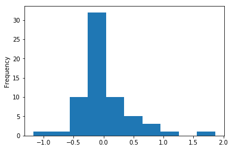
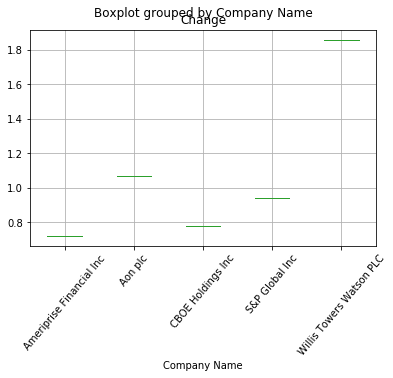

```python
import wget
import pandas as pd
```


```python
file_url = 'http://www.sectorspdr.com/sectorspdr/IDCO.Client.Spdrs.Holdings/Export/ExportCsv?symbol='
string = "XLF"
etf = wget.download(file_url + string)

new_file = pd.read_csv(etf, skiprows=1)
# can add skiprows=1 to get rid of the first row  
new_file.head()
# to check how many columns and rows do we have to inspect your data set
# new_file.shape
```


<div>
<table border="1" class="dataframe">
  <thead>
    <tr style="text-align: right;">
      <th></th>
      <th>Symbol</th>
      <th>Company Name</th>
      <th>Index Weight</th>
      <th>Last</th>
      <th>Change</th>
      <th>%Change</th>
      <th>Volume</th>
      <th>52 Week Range</th>
      <th>Unnamed: 8</th>
    </tr>
  </thead>
  <tbody>
    <tr>
      <th>0</th>
      <td>BRK.b</td>
      <td>Berkshire Hathaway B</td>
      <td>10.84%</td>
      <td>166.55</td>
      <td>0.21</td>
      <td>+0.13%</td>
      <td>3.58 M</td>
      <td>136.65 - 177.86</td>
      <td>NaN</td>
    </tr>
    <tr>
      <th>1</th>
      <td>JPM</td>
      <td>JP Morgan Chase &amp; Co</td>
      <td>10.65%</td>
      <td>87.00</td>
      <td>-0.10</td>
      <td>-0.11%</td>
      <td>9.44 M</td>
      <td>57.05 - 93.98</td>
      <td>NaN</td>
    </tr>
    <tr>
      <th>2</th>
      <td>WFC</td>
      <td>Wells Fargo &amp; Co</td>
      <td>8.50%</td>
      <td>55.11</td>
      <td>-0.07</td>
      <td>-0.13%</td>
      <td>13.08 M</td>
      <td>43.55 - 59.99</td>
      <td>NaN</td>
    </tr>
    <tr>
      <th>3</th>
      <td>BAC</td>
      <td>Bank of America Corp</td>
      <td>8.15%</td>
      <td>23.74</td>
      <td>-0.11</td>
      <td>-0.46%</td>
      <td>56.68 M</td>
      <td>12.05 - 25.80</td>
      <td>NaN</td>
    </tr>
    <tr>
      <th>4</th>
      <td>C</td>
      <td>Citigroup Inc</td>
      <td>5.72%</td>
      <td>60.24</td>
      <td>0.03</td>
      <td>+0.05%</td>
      <td>11.48 M</td>
      <td>38.31 - 62.53</td>
      <td>NaN</td>
    </tr>
  </tbody>
</table>
</div>


```python
# drop a variable (column)
# axis=1 denotes that we are referring to a column, not a row
new_file = new_file.drop('Unnamed: 8', axis=1)
new_file.head()
```


<div>
<table border="1" class="dataframe">
  <thead>
    <tr style="text-align: right;">
      <th></th>
      <th>Symbol</th>
      <th>Company Name</th>
      <th>Index Weight</th>
      <th>Last</th>
      <th>Change</th>
      <th>%Change</th>
      <th>Volume</th>
      <th>52 Week Range</th>
    </tr>
  </thead>
  <tbody>
    <tr>
      <th>0</th>
      <td>BRK.b</td>
      <td>Berkshire Hathaway B</td>
      <td>10.84%</td>
      <td>166.55</td>
      <td>0.21</td>
      <td>+0.13%</td>
      <td>3.58 M</td>
      <td>136.65 - 177.86</td>
    </tr>
    <tr>
      <th>1</th>
      <td>JPM</td>
      <td>JP Morgan Chase &amp; Co</td>
      <td>10.65%</td>
      <td>87.00</td>
      <td>-0.10</td>
      <td>-0.11%</td>
      <td>9.44 M</td>
      <td>57.05 - 93.98</td>
    </tr>
    <tr>
      <th>2</th>
      <td>WFC</td>
      <td>Wells Fargo &amp; Co</td>
      <td>8.50%</td>
      <td>55.11</td>
      <td>-0.07</td>
      <td>-0.13%</td>
      <td>13.08 M</td>
      <td>43.55 - 59.99</td>
    </tr>
    <tr>
      <th>3</th>
      <td>BAC</td>
      <td>Bank of America Corp</td>
      <td>8.15%</td>
      <td>23.74</td>
      <td>-0.11</td>
      <td>-0.46%</td>
      <td>56.68 M</td>
      <td>12.05 - 25.80</td>
    </tr>
    <tr>
      <th>4</th>
      <td>C</td>
      <td>Citigroup Inc</td>
      <td>5.72%</td>
      <td>60.24</td>
      <td>0.03</td>
      <td>+0.05%</td>
      <td>11.48 M</td>
      <td>38.31 - 62.53</td>
    </tr>
  </tbody>
</table>
</div>


```python
# change index to a symbol
new_file.index = new_file.Symbol
new_file = new_file.drop('Symbol', axis=1)
new_file.head()
```


<div>
<table border="1" class="dataframe">
  <thead>
    <tr style="text-align: right;">
      <th></th>
      <th>Company Name</th>
      <th>Index Weight</th>
      <th>Last</th>
      <th>Change</th>
      <th>%Change</th>
      <th>Volume</th>
      <th>52 Week Range</th>
    </tr>
    <tr>
      <th>Symbol</th>
      <th></th>
      <th></th>
      <th></th>
      <th></th>
      <th></th>
      <th></th>
      <th></th>
    </tr>
  </thead>
  <tbody>
    <tr>
      <th>BRK.b</th>
      <td>Berkshire Hathaway B</td>
      <td>10.84%</td>
      <td>166.55</td>
      <td>0.21</td>
      <td>+0.13%</td>
      <td>3.58 M</td>
      <td>136.65 - 177.86</td>
    </tr>
    <tr>
      <th>JPM</th>
      <td>JP Morgan Chase &amp; Co</td>
      <td>10.65%</td>
      <td>87.00</td>
      <td>-0.10</td>
      <td>-0.11%</td>
      <td>9.44 M</td>
      <td>57.05 - 93.98</td>
    </tr>
    <tr>
      <th>WFC</th>
      <td>Wells Fargo &amp; Co</td>
      <td>8.50%</td>
      <td>55.11</td>
      <td>-0.07</td>
      <td>-0.13%</td>
      <td>13.08 M</td>
      <td>43.55 - 59.99</td>
    </tr>
    <tr>
      <th>BAC</th>
      <td>Bank of America Corp</td>
      <td>8.15%</td>
      <td>23.74</td>
      <td>-0.11</td>
      <td>-0.46%</td>
      <td>56.68 M</td>
      <td>12.05 - 25.80</td>
    </tr>
    <tr>
      <th>C</th>
      <td>Citigroup Inc</td>
      <td>5.72%</td>
      <td>60.24</td>
      <td>0.03</td>
      <td>+0.05%</td>
      <td>11.48 M</td>
      <td>38.31 - 62.53</td>
    </tr>
  </tbody>
</table>
</div>


```python
# drop an observation (row)
new_file = new_file.drop(['BRK.b'])
new_file.head()
```


<div>
<table border="1" class="dataframe">
  <thead>
    <tr style="text-align: right;">
      <th></th>
      <th>Company Name</th>
      <th>Index Weight</th>
      <th>Last</th>
      <th>Change</th>
      <th>%Change</th>
      <th>Volume</th>
      <th>52 Week Range</th>
    </tr>
    <tr>
      <th>Symbol</th>
      <th></th>
      <th></th>
      <th></th>
      <th></th>
      <th></th>
      <th></th>
      <th></th>
    </tr>
  </thead>
  <tbody>
    <tr>
      <th>JPM</th>
      <td>JP Morgan Chase &amp; Co</td>
      <td>10.65%</td>
      <td>87.00</td>
      <td>-0.10</td>
      <td>-0.11%</td>
      <td>9.44 M</td>
      <td>57.05 - 93.98</td>
    </tr>
    <tr>
      <th>WFC</th>
      <td>Wells Fargo &amp; Co</td>
      <td>8.50%</td>
      <td>55.11</td>
      <td>-0.07</td>
      <td>-0.13%</td>
      <td>13.08 M</td>
      <td>43.55 - 59.99</td>
    </tr>
    <tr>
      <th>BAC</th>
      <td>Bank of America Corp</td>
      <td>8.15%</td>
      <td>23.74</td>
      <td>-0.11</td>
      <td>-0.46%</td>
      <td>56.68 M</td>
      <td>12.05 - 25.80</td>
    </tr>
    <tr>
      <th>C</th>
      <td>Citigroup Inc</td>
      <td>5.72%</td>
      <td>60.24</td>
      <td>0.03</td>
      <td>+0.05%</td>
      <td>11.48 M</td>
      <td>38.31 - 62.53</td>
    </tr>
    <tr>
      <th>GS</th>
      <td>Goldman Sachs Group Inc</td>
      <td>2.88%</td>
      <td>226.87</td>
      <td>0.28</td>
      <td>+0.12%</td>
      <td>2.44 M</td>
      <td>138.20 - 255.15</td>
    </tr>
  </tbody>
</table>
</div>


```python
# let's take a look at index of columns names
new_file.columns
```


    Index(['Company Name', 'Index Weight', 'Last', 'Change', '%Change', 'Volume',
           '52 Week Range'],
          dtype='object')


```python
# info to get additional info about our data set
# so we got pandas data frame of 64 rows and 9 columns
# object type is a generic type in pandas stored as a string 
new_file.info()
```

    <class 'pandas.core.frame.DataFrame'>
    Index: 64 entries, JPM to NAVI
    Data columns (total 7 columns):
    Company Name     64 non-null object
    Index Weight     64 non-null object
    Last             64 non-null float64
    Change           64 non-null float64
    %Change          64 non-null object
    Volume           64 non-null object
    52 Week Range    64 non-null object
    dtypes: float64(2), object(5)
    memory usage: 4.0+ KB


```python
# exploratory data analysis
# counts of unique values
new_file.Change.value_counts().head(10)
```


    -0.12    3
    -0.09    3
    -0.03    3
     0.12    3
    -0.33    2
    -0.11    2
    -0.13    2
    -0.41    2
    -0.55    2
    -0.06    2
    Name: Change, dtype: int64


```python
# summary statistics (performed on numeric data only)
new_file.describe()
```


<div>
<table border="1" class="dataframe">
  <thead>
    <tr style="text-align: right;">
      <th></th>
      <th>Last</th>
      <th>Change</th>
    </tr>
  </thead>
  <tbody>
    <tr>
      <th>count</th>
      <td>64.000000</td>
      <td>64.000000</td>
    </tr>
    <tr>
      <th>mean</th>
      <td>76.300625</td>
      <td>0.006563</td>
    </tr>
    <tr>
      <th>std</th>
      <td>57.229060</td>
      <td>0.437254</td>
    </tr>
    <tr>
      <th>min</th>
      <td>12.990000</td>
      <td>-1.170000</td>
    </tr>
    <tr>
      <th>25%</th>
      <td>42.670000</td>
      <td>-0.172500</td>
    </tr>
    <tr>
      <th>50%</th>
      <td>63.525000</td>
      <td>-0.060000</td>
    </tr>
    <tr>
      <th>75%</th>
      <td>87.882500</td>
      <td>0.122500</td>
    </tr>
    <tr>
      <th>max</th>
      <td>383.760000</td>
      <td>1.860000</td>
    </tr>
  </tbody>
</table>
</div>


```python
import matplotlib.pyplot as plt
new_file.Change.plot('hist')
plt.show()
```





```python
# lets identify the growth drivers (outliers)
stat = new_file[new_file.Change > 0.5]
stat.head()
```


<div>
<table border="1" class="dataframe">
  <thead>
    <tr style="text-align: right;">
      <th></th>
      <th>Company Name</th>
      <th>Index Weight</th>
      <th>Last</th>
      <th>Change</th>
      <th>%Change</th>
      <th>Volume</th>
      <th>52 Week Range</th>
    </tr>
    <tr>
      <th>Symbol</th>
      <th></th>
      <th></th>
      <th></th>
      <th></th>
      <th></th>
      <th></th>
      <th></th>
    </tr>
  </thead>
  <tbody>
    <tr>
      <th>SPGI</th>
      <td>S&amp;P Global Inc</td>
      <td>1.22%</td>
      <td>137.55</td>
      <td>0.94</td>
      <td>+0.69%</td>
      <td>1.06 M</td>
      <td>97.65 - 138.05</td>
    </tr>
    <tr>
      <th>AON</th>
      <td>Aon plc</td>
      <td>1.10%</td>
      <td>122.27</td>
      <td>1.07</td>
      <td>+0.88%</td>
      <td>1.21 M</td>
      <td>100.55 - 122.39</td>
    </tr>
    <tr>
      <th>AMP</th>
      <td>Ameriprise Financial Inc</td>
      <td>0.68%</td>
      <td>128.82</td>
      <td>0.72</td>
      <td>+0.56%</td>
      <td>755.50 K</td>
      <td>84.92 - 135.20</td>
    </tr>
    <tr>
      <th>WLTW</th>
      <td>Willis Towers Watson PLC</td>
      <td>0.63%</td>
      <td>144.20</td>
      <td>1.86</td>
      <td>+1.31%</td>
      <td>1.70 M</td>
      <td>112.76 - 144.21</td>
    </tr>
    <tr>
      <th>CBOE</th>
      <td>CBOE Holdings Inc</td>
      <td>0.26%</td>
      <td>83.76</td>
      <td>0.78</td>
      <td>+0.94%</td>
      <td>886.87 K</td>
      <td>61.58 - 84.63</td>
    </tr>
  </tbody>
</table>
</div>


```python
# descriptive statistics 
# boxplot is a convenient way of graphically reresenting groups of numerical data 
# through their quartiles
stat.boxplot(column='Change', by='Company Name')
plt.xticks(rotation=50)
plt.show()
```





```python
new_file[new_file['Volume'].str.contains("K")]
```


<div>
<table border="1" class="dataframe">
  <thead>
    <tr style="text-align: right;">
      <th></th>
      <th>Company Name</th>
      <th>Index Weight</th>
      <th>Last</th>
      <th>Change</th>
      <th>%Change</th>
      <th>Volume</th>
      <th>52 Week Range</th>
    </tr>
    <tr>
      <th>Symbol</th>
      <th></th>
      <th></th>
      <th></th>
      <th></th>
      <th></th>
      <th></th>
      <th></th>
    </tr>
  </thead>
  <tbody>
    <tr>
      <th>BLK</th>
      <td>BlackRock Inc</td>
      <td>1.60%</td>
      <td>383.76</td>
      <td>0.45</td>
      <td>+0.12%</td>
      <td>536.31 K</td>
      <td>317.60 - 399.46</td>
    </tr>
    <tr>
      <th>MTB</th>
      <td>M&amp;T Bank Corp</td>
      <td>0.84%</td>
      <td>158.93</td>
      <td>-0.16</td>
      <td>-0.10%</td>
      <td>365.93 K</td>
      <td>108.04 - 173.72</td>
    </tr>
    <tr>
      <th>AMP</th>
      <td>Ameriprise Financial Inc</td>
      <td>0.68%</td>
      <td>128.82</td>
      <td>0.72</td>
      <td>+0.56%</td>
      <td>755.50 K</td>
      <td>84.92 - 135.20</td>
    </tr>
    <tr>
      <th>PFG</th>
      <td>Principal Financial Group</td>
      <td>0.59%</td>
      <td>64.34</td>
      <td>-0.09</td>
      <td>-0.14%</td>
      <td>882.27 K</td>
      <td>38.04 - 65.67</td>
    </tr>
    <tr>
      <th>L</th>
      <td>Loews Corp</td>
      <td>0.44%</td>
      <td>47.01</td>
      <td>0.26</td>
      <td>+0.56%</td>
      <td>705.67 K</td>
      <td>38.17 - 48.05</td>
    </tr>
    <tr>
      <th>CMA</th>
      <td>Comerica Inc (MI)</td>
      <td>0.43%</td>
      <td>71.60</td>
      <td>-0.34</td>
      <td>-0.47%</td>
      <td>994.32 K</td>
      <td>36.82 - 75.00</td>
    </tr>
    <tr>
      <th>UNM</th>
      <td>Unum Group</td>
      <td>0.37%</td>
      <td>46.58</td>
      <td>-0.09</td>
      <td>-0.19%</td>
      <td>677.38 K</td>
      <td>29.79 - 50.27</td>
    </tr>
    <tr>
      <th>CINF</th>
      <td>Cincinnati Financial Corp</td>
      <td>0.36%</td>
      <td>70.83</td>
      <td>-0.13</td>
      <td>-0.18%</td>
      <td>567.87 K</td>
      <td>65.62 - 79.60</td>
    </tr>
    <tr>
      <th>AJG</th>
      <td>Gallagher Arthur J. &amp; Co</td>
      <td>0.34%</td>
      <td>55.71</td>
      <td>0.35</td>
      <td>+0.63%</td>
      <td>655.02 K</td>
      <td>43.90 - 57.82</td>
    </tr>
    <tr>
      <th>RJF</th>
      <td>Raymond James Financial Inc</td>
      <td>0.33%</td>
      <td>76.00</td>
      <td>-0.41</td>
      <td>-0.54%</td>
      <td>673.05 K</td>
      <td>46.30 - 81.92</td>
    </tr>
    <tr>
      <th>AMG</th>
      <td>Affiliated Managers Grp</td>
      <td>0.30%</td>
      <td>154.71</td>
      <td>-0.72</td>
      <td>-0.46%</td>
      <td>627.28 K</td>
      <td>130.48 - 177.77</td>
    </tr>
    <tr>
      <th>TMK</th>
      <td>Torchmark Corp</td>
      <td>0.29%</td>
      <td>76.83</td>
      <td>0.12</td>
      <td>+0.16%</td>
      <td>332.40 K</td>
      <td>57.16 - 79.53</td>
    </tr>
    <tr>
      <th>NDAQ</th>
      <td>Nasdaq Inc</td>
      <td>0.27%</td>
      <td>67.91</td>
      <td>-0.05</td>
      <td>-0.07%</td>
      <td>579.12 K</td>
      <td>61.19 - 72.52</td>
    </tr>
    <tr>
      <th>CBOE</th>
      <td>CBOE Holdings Inc</td>
      <td>0.26%</td>
      <td>83.76</td>
      <td>0.78</td>
      <td>+0.94%</td>
      <td>886.87 K</td>
      <td>61.58 - 84.63</td>
    </tr>
    <tr>
      <th>AIZ</th>
      <td>Assurant Inc</td>
      <td>0.20%</td>
      <td>103.92</td>
      <td>-0.55</td>
      <td>-0.53%</td>
      <td>351.16 K</td>
      <td>78.50 - 106.02</td>
    </tr>
  </tbody>
</table>
</div>


```python
def num_k(x):
    if "K" in x:
        x = x.replace('K', ' ')
        x = pd.to_numeric(x, errors='coerce')
        x *= 1000
#         print("K",x)
    else:
        x = x.replace('M', ' ')
        x = pd.to_numeric(x, errors='coerce')
        x *= 1000000
#         print("M",x)
    return x 

new_file['Volume'] = new_file['Volume'].apply(num_k)
new_file.head()
```


<div>
<table border="1" class="dataframe">
  <thead>
    <tr style="text-align: right;">
      <th></th>
      <th>Company Name</th>
      <th>Index Weight</th>
      <th>Last</th>
      <th>Change</th>
      <th>%Change</th>
      <th>Volume</th>
      <th>52 Week Range</th>
    </tr>
    <tr>
      <th>Symbol</th>
      <th></th>
      <th></th>
      <th></th>
      <th></th>
      <th></th>
      <th></th>
      <th></th>
    </tr>
  </thead>
  <tbody>
    <tr>
      <th>JPM</th>
      <td>JP Morgan Chase &amp; Co</td>
      <td>10.65%</td>
      <td>87.00</td>
      <td>-0.10</td>
      <td>-0.11%</td>
      <td>9440000.0</td>
      <td>57.05 - 93.98</td>
    </tr>
    <tr>
      <th>WFC</th>
      <td>Wells Fargo &amp; Co</td>
      <td>8.50%</td>
      <td>55.11</td>
      <td>-0.07</td>
      <td>-0.13%</td>
      <td>13080000.0</td>
      <td>43.55 - 59.99</td>
    </tr>
    <tr>
      <th>BAC</th>
      <td>Bank of America Corp</td>
      <td>8.15%</td>
      <td>23.74</td>
      <td>-0.11</td>
      <td>-0.46%</td>
      <td>56680000.0</td>
      <td>12.05 - 25.80</td>
    </tr>
    <tr>
      <th>C</th>
      <td>Citigroup Inc</td>
      <td>5.72%</td>
      <td>60.24</td>
      <td>0.03</td>
      <td>+0.05%</td>
      <td>11480000.0</td>
      <td>38.31 - 62.53</td>
    </tr>
    <tr>
      <th>GS</th>
      <td>Goldman Sachs Group Inc</td>
      <td>2.88%</td>
      <td>226.87</td>
      <td>0.28</td>
      <td>+0.12%</td>
      <td>2440000.0</td>
      <td>138.20 - 255.15</td>
    </tr>
  </tbody>
</table>
</div>


```python
new_file.Volume.sum()
```


    234320150.0


```python
# lets get drop % in Index Weight
new_file["Index Weight"] = new_file["Index Weight"].str.replace("%", "").apply(pd.to_numeric)
new_file.head()
```


<div>
<table border="1" class="dataframe">
  <thead>
    <tr style="text-align: right;">
      <th></th>
      <th>Company Name</th>
      <th>Index Weight</th>
      <th>Last</th>
      <th>Change</th>
      <th>%Change</th>
      <th>Volume</th>
      <th>52 Week Range</th>
    </tr>
    <tr>
      <th>Symbol</th>
      <th></th>
      <th></th>
      <th></th>
      <th></th>
      <th></th>
      <th></th>
      <th></th>
    </tr>
  </thead>
  <tbody>
    <tr>
      <th>JPM</th>
      <td>JP Morgan Chase &amp; Co</td>
      <td>10.65</td>
      <td>87.00</td>
      <td>-0.10</td>
      <td>-0.11%</td>
      <td>9440000.0</td>
      <td>57.05 - 93.98</td>
    </tr>
    <tr>
      <th>WFC</th>
      <td>Wells Fargo &amp; Co</td>
      <td>8.50</td>
      <td>55.11</td>
      <td>-0.07</td>
      <td>-0.13%</td>
      <td>13080000.0</td>
      <td>43.55 - 59.99</td>
    </tr>
    <tr>
      <th>BAC</th>
      <td>Bank of America Corp</td>
      <td>8.15</td>
      <td>23.74</td>
      <td>-0.11</td>
      <td>-0.46%</td>
      <td>56680000.0</td>
      <td>12.05 - 25.80</td>
    </tr>
    <tr>
      <th>C</th>
      <td>Citigroup Inc</td>
      <td>5.72</td>
      <td>60.24</td>
      <td>0.03</td>
      <td>+0.05%</td>
      <td>11480000.0</td>
      <td>38.31 - 62.53</td>
    </tr>
    <tr>
      <th>GS</th>
      <td>Goldman Sachs Group Inc</td>
      <td>2.88</td>
      <td>226.87</td>
      <td>0.28</td>
      <td>+0.12%</td>
      <td>2440000.0</td>
      <td>138.20 - 255.15</td>
    </tr>
  </tbody>
</table>
</div>


```python
new_file.info()
```

    <class 'pandas.core.frame.DataFrame'>
    Index: 64 entries, JPM to NAVI
    Data columns (total 7 columns):
    Company Name     64 non-null object
    Index Weight     64 non-null float64
    Last             64 non-null float64
    Change           64 non-null float64
    %Change          64 non-null object
    Volume           64 non-null float64
    52 Week Range    64 non-null object
    dtypes: float64(4), object(3)
    memory usage: 4.0+ KB


```python

```
