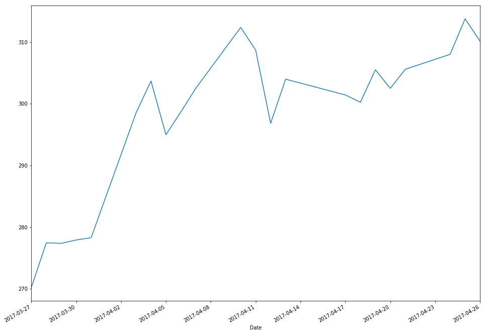
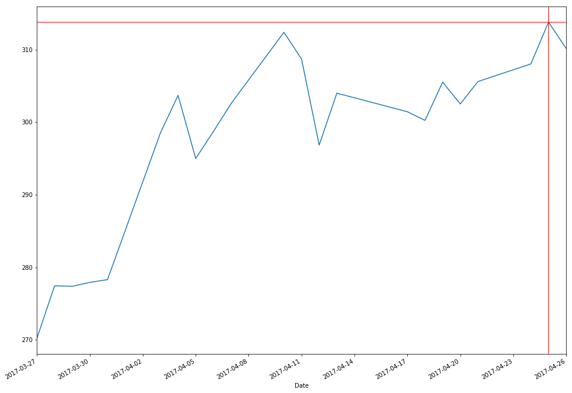
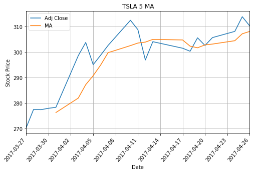

```python
#import pandas
import pandas as pd
from datetime import date
#import matplotlib
import matplotlib.pyplot as plt
```


```python
# create a new variable to hold data and set dates as index
new_file = pd.read_csv("TSLA.csv",parse_dates=['Date'])
new_file.set_index('Date',inplace=True)  
new_file.tail(2)
```


<div>
<table border="1" class="dataframe">
  <thead>
    <tr style="text-align: right;">
      <th></th>
      <th>Open</th>
      <th>High</th>
      <th>Low</th>
      <th>Close</th>
      <th>Volume</th>
      <th>Adj Close</th>
    </tr>
    <tr>
      <th>Date</th>
      <th></th>
      <th></th>
      <th></th>
      <th></th>
      <th></th>
      <th></th>
    </tr>
  </thead>
  <tbody>
    <tr>
      <th>2017-03-28</th>
      <td>277.019989</td>
      <td>280.679993</td>
      <td>275.00</td>
      <td>277.450012</td>
      <td>7966200</td>
      <td>277.450012</td>
    </tr>
    <tr>
      <th>2017-03-27</th>
      <td>260.600006</td>
      <td>270.570007</td>
      <td>259.75</td>
      <td>270.220001</td>
      <td>6217800</td>
      <td>270.220001</td>
    </tr>
  </tbody>
</table>
</div>


```python
# use plot and plt.show() to plot graph
new_file['Adj Close'].plot(figsize=(16, 12))
plt.show()
```





```python
# lets get the minimum Adj closing price and get index
max_close_price = new_file['Adj Close'].max()
idx_close_price = new_file['Adj Close'].idxmax()
print(max_close_price)
idx_close_price
```

    313.790009


    Timestamp('2017-04-25 00:00:00')


```python
# now we want to draw lines at that index and min price
new_file['Adj Close'].plot(figsize=(16, 12))
verical_line = plt.axvline(date(2017,4,25), linewidth=1, color='r')
horizontal_line = plt.axhline(y=max_close_price, linewidth=1, color='r')
```


```python
plt.show()
```





```python
new_file.head()
```


<div>
<table border="1" class="dataframe">
  <thead>
    <tr style="text-align: right;">
      <th></th>
      <th>Open</th>
      <th>High</th>
      <th>Low</th>
      <th>Close</th>
      <th>Volume</th>
      <th>Adj Close</th>
    </tr>
    <tr>
      <th>Date</th>
      <th></th>
      <th></th>
      <th></th>
      <th></th>
      <th></th>
      <th></th>
    </tr>
  </thead>
  <tbody>
    <tr>
      <th>2017-04-26</th>
      <td>312.369995</td>
      <td>314.500000</td>
      <td>309.000000</td>
      <td>310.170013</td>
      <td>4544400</td>
      <td>310.170013</td>
    </tr>
    <tr>
      <th>2017-04-25</th>
      <td>308.000000</td>
      <td>313.980011</td>
      <td>305.859985</td>
      <td>313.790009</td>
      <td>6711900</td>
      <td>313.790009</td>
    </tr>
    <tr>
      <th>2017-04-24</th>
      <td>309.220001</td>
      <td>310.549988</td>
      <td>306.019989</td>
      <td>308.029999</td>
      <td>5075200</td>
      <td>308.029999</td>
    </tr>
    <tr>
      <th>2017-04-21</th>
      <td>302.000000</td>
      <td>306.399994</td>
      <td>300.420013</td>
      <td>305.600006</td>
      <td>4487500</td>
      <td>305.600006</td>
    </tr>
    <tr>
      <th>2017-04-20</th>
      <td>306.510010</td>
      <td>309.149994</td>
      <td>300.230011</td>
      <td>302.510010</td>
      <td>6132600</td>
      <td>302.510010</td>
    </tr>
  </tbody>
</table>
</div>


```python
stock = new_file.reindex(index=new_file.index[::-1])
stock.head()
```


<div>
<table border="1" class="dataframe">
  <thead>
    <tr style="text-align: right;">
      <th></th>
      <th>Open</th>
      <th>High</th>
      <th>Low</th>
      <th>Close</th>
      <th>Volume</th>
      <th>Adj Close</th>
    </tr>
    <tr>
      <th>Date</th>
      <th></th>
      <th></th>
      <th></th>
      <th></th>
      <th></th>
      <th></th>
    </tr>
  </thead>
  <tbody>
    <tr>
      <th>2017-03-27</th>
      <td>260.600006</td>
      <td>270.570007</td>
      <td>259.750000</td>
      <td>270.220001</td>
      <td>6217800</td>
      <td>270.220001</td>
    </tr>
    <tr>
      <th>2017-03-28</th>
      <td>277.019989</td>
      <td>280.679993</td>
      <td>275.000000</td>
      <td>277.450012</td>
      <td>7966200</td>
      <td>277.450012</td>
    </tr>
    <tr>
      <th>2017-03-29</th>
      <td>278.339996</td>
      <td>279.600006</td>
      <td>275.540009</td>
      <td>277.380005</td>
      <td>3667800</td>
      <td>277.380005</td>
    </tr>
    <tr>
      <th>2017-03-30</th>
      <td>278.040009</td>
      <td>282.000000</td>
      <td>277.209991</td>
      <td>277.920013</td>
      <td>4136700</td>
      <td>277.920013</td>
    </tr>
    <tr>
      <th>2017-03-31</th>
      <td>278.730011</td>
      <td>279.679993</td>
      <td>276.320007</td>
      <td>278.299988</td>
      <td>3288600</td>
      <td>278.299988</td>
    </tr>
  </tbody>
</table>
</div>


```python
stock['MA'] = stock['Adj Close'].rolling(window=5).mean()
stock.head()
```


<div>
<table border="1" class="dataframe">
  <thead>
    <tr style="text-align: right;">
      <th></th>
      <th>Open</th>
      <th>High</th>
      <th>Low</th>
      <th>Close</th>
      <th>Volume</th>
      <th>Adj Close</th>
      <th>MA</th>
    </tr>
    <tr>
      <th>Date</th>
      <th></th>
      <th></th>
      <th></th>
      <th></th>
      <th></th>
      <th></th>
      <th></th>
    </tr>
  </thead>
  <tbody>
    <tr>
      <th>2017-03-27</th>
      <td>260.600006</td>
      <td>270.570007</td>
      <td>259.750000</td>
      <td>270.220001</td>
      <td>6217800</td>
      <td>270.220001</td>
      <td>NaN</td>
    </tr>
    <tr>
      <th>2017-03-28</th>
      <td>277.019989</td>
      <td>280.679993</td>
      <td>275.000000</td>
      <td>277.450012</td>
      <td>7966200</td>
      <td>277.450012</td>
      <td>NaN</td>
    </tr>
    <tr>
      <th>2017-03-29</th>
      <td>278.339996</td>
      <td>279.600006</td>
      <td>275.540009</td>
      <td>277.380005</td>
      <td>3667800</td>
      <td>277.380005</td>
      <td>NaN</td>
    </tr>
    <tr>
      <th>2017-03-30</th>
      <td>278.040009</td>
      <td>282.000000</td>
      <td>277.209991</td>
      <td>277.920013</td>
      <td>4136700</td>
      <td>277.920013</td>
      <td>NaN</td>
    </tr>
    <tr>
      <th>2017-03-31</th>
      <td>278.730011</td>
      <td>279.679993</td>
      <td>276.320007</td>
      <td>278.299988</td>
      <td>3288600</td>
      <td>278.299988</td>
      <td>276.254004</td>
    </tr>
  </tbody>
</table>
</div>


```python
stock.dropna(how='any')
```


<div>
<table border="1" class="dataframe">
  <thead>
    <tr style="text-align: right;">
      <th></th>
      <th>Open</th>
      <th>High</th>
      <th>Low</th>
      <th>Close</th>
      <th>Volume</th>
      <th>Adj Close</th>
      <th>MA</th>
    </tr>
    <tr>
      <th>Date</th>
      <th></th>
      <th></th>
      <th></th>
      <th></th>
      <th></th>
      <th></th>
      <th></th>
    </tr>
  </thead>
  <tbody>
    <tr>
      <th>2017-03-31</th>
      <td>278.730011</td>
      <td>279.679993</td>
      <td>276.320007</td>
      <td>278.299988</td>
      <td>3288600</td>
      <td>278.299988</td>
      <td>276.254004</td>
    </tr>
    <tr>
      <th>2017-04-03</th>
      <td>286.899994</td>
      <td>299.000000</td>
      <td>284.579987</td>
      <td>298.519989</td>
      <td>13842300</td>
      <td>298.519989</td>
      <td>281.914001</td>
    </tr>
    <tr>
      <th>2017-04-04</th>
      <td>296.890015</td>
      <td>304.809998</td>
      <td>294.529999</td>
      <td>303.700012</td>
      <td>10099400</td>
      <td>303.700012</td>
      <td>287.164001</td>
    </tr>
    <tr>
      <th>2017-04-05</th>
      <td>302.040009</td>
      <td>304.880005</td>
      <td>294.200012</td>
      <td>295.000000</td>
      <td>7839500</td>
      <td>295.000000</td>
      <td>290.688000</td>
    </tr>
    <tr>
      <th>2017-04-06</th>
      <td>296.880005</td>
      <td>301.940002</td>
      <td>294.100006</td>
      <td>298.700012</td>
      <td>5512600</td>
      <td>298.700012</td>
      <td>294.844000</td>
    </tr>
    <tr>
      <th>2017-04-07</th>
      <td>297.500000</td>
      <td>302.690002</td>
      <td>297.149994</td>
      <td>302.540009</td>
      <td>4524200</td>
      <td>302.540009</td>
      <td>299.692004</td>
    </tr>
    <tr>
      <th>2017-04-10</th>
      <td>309.149994</td>
      <td>313.730011</td>
      <td>308.709991</td>
      <td>312.390015</td>
      <td>7619300</td>
      <td>312.390015</td>
      <td>302.466010</td>
    </tr>
    <tr>
      <th>2017-04-11</th>
      <td>313.380005</td>
      <td>313.470001</td>
      <td>305.500000</td>
      <td>308.709991</td>
      <td>5716100</td>
      <td>308.709991</td>
      <td>303.468005</td>
    </tr>
    <tr>
      <th>2017-04-12</th>
      <td>306.339996</td>
      <td>308.450012</td>
      <td>296.320007</td>
      <td>296.839996</td>
      <td>6035100</td>
      <td>296.839996</td>
      <td>303.836005</td>
    </tr>
    <tr>
      <th>2017-04-13</th>
      <td>296.700012</td>
      <td>307.390015</td>
      <td>295.299988</td>
      <td>304.000000</td>
      <td>9246200</td>
      <td>304.000000</td>
      <td>304.896002</td>
    </tr>
    <tr>
      <th>2017-04-17</th>
      <td>302.700012</td>
      <td>304.000000</td>
      <td>298.679993</td>
      <td>301.440002</td>
      <td>4107600</td>
      <td>301.440002</td>
      <td>304.676001</td>
    </tr>
    <tr>
      <th>2017-04-18</th>
      <td>299.700012</td>
      <td>300.839996</td>
      <td>297.899994</td>
      <td>300.250000</td>
      <td>3033800</td>
      <td>300.250000</td>
      <td>302.247998</td>
    </tr>
    <tr>
      <th>2017-04-19</th>
      <td>302.459991</td>
      <td>306.619995</td>
      <td>302.109985</td>
      <td>305.519989</td>
      <td>3867300</td>
      <td>305.519989</td>
      <td>301.609997</td>
    </tr>
    <tr>
      <th>2017-04-20</th>
      <td>306.510010</td>
      <td>309.149994</td>
      <td>300.230011</td>
      <td>302.510010</td>
      <td>6132600</td>
      <td>302.510010</td>
      <td>302.744000</td>
    </tr>
    <tr>
      <th>2017-04-21</th>
      <td>302.000000</td>
      <td>306.399994</td>
      <td>300.420013</td>
      <td>305.600006</td>
      <td>4487500</td>
      <td>305.600006</td>
      <td>303.064001</td>
    </tr>
    <tr>
      <th>2017-04-24</th>
      <td>309.220001</td>
      <td>310.549988</td>
      <td>306.019989</td>
      <td>308.029999</td>
      <td>5075200</td>
      <td>308.029999</td>
      <td>304.382001</td>
    </tr>
    <tr>
      <th>2017-04-25</th>
      <td>308.000000</td>
      <td>313.980011</td>
      <td>305.859985</td>
      <td>313.790009</td>
      <td>6711900</td>
      <td>313.790009</td>
      <td>307.090003</td>
    </tr>
    <tr>
      <th>2017-04-26</th>
      <td>312.369995</td>
      <td>314.500000</td>
      <td>309.000000</td>
      <td>310.170013</td>
      <td>4544400</td>
      <td>310.170013</td>
      <td>308.020007</td>
    </tr>
  </tbody>
</table>
</div>


```python
stock[['Adj Close', 'MA']].plot(grid=True, figsize=(8,5))
plt.xlabel('Date')
plt.ylabel('Stock Price')
plt.title("TSLA 5 MA")
plt.xticks(rotation=50)

plt.show()
```





```python

```
