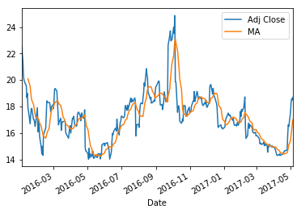
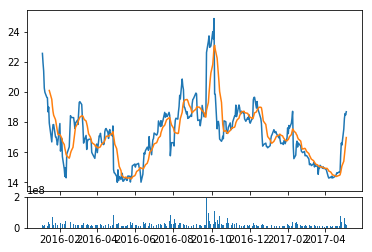

```python
# Importing liabraries and DataReader
import pandas as pd 
import pandas_datareader.data as web
import matplotlib.pyplot as plt 
import datetime
from datetime import date
```


```python
# Setting time range
start = date(2016,1,1)
end = date.today()
```


```python
# Getting data for a stock
stock_price = web.DataReader("TWTR", "yahoo", start, end)
stock_price.tail()
```


<div>
<table border="1" class="dataframe">
  <thead>
    <tr style="text-align: right;">
      <th></th>
      <th>Open</th>
      <th>High</th>
      <th>Low</th>
      <th>Close</th>
      <th>Volume</th>
      <th>Adj Close</th>
    </tr>
    <tr>
      <th>Date</th>
      <th></th>
      <th></th>
      <th></th>
      <th></th>
      <th></th>
      <th></th>
    </tr>
  </thead>
  <tbody>
    <tr>
      <th>2017-05-01</th>
      <td>17.139999</td>
      <td>17.650000</td>
      <td>16.969999</td>
      <td>17.540001</td>
      <td>47011200</td>
      <td>17.540001</td>
    </tr>
    <tr>
      <th>2017-05-02</th>
      <td>17.570000</td>
      <td>18.530001</td>
      <td>17.350000</td>
      <td>18.240000</td>
      <td>63781300</td>
      <td>18.240000</td>
    </tr>
    <tr>
      <th>2017-05-03</th>
      <td>18.370001</td>
      <td>18.600000</td>
      <td>18.150000</td>
      <td>18.570000</td>
      <td>29514800</td>
      <td>18.570000</td>
    </tr>
    <tr>
      <th>2017-05-04</th>
      <td>18.600000</td>
      <td>18.889999</td>
      <td>18.360001</td>
      <td>18.480000</td>
      <td>24565300</td>
      <td>18.480000</td>
    </tr>
    <tr>
      <th>2017-05-05</th>
      <td>18.450001</td>
      <td>18.730000</td>
      <td>18.370001</td>
      <td>18.690001</td>
      <td>15021600</td>
      <td>18.690001</td>
    </tr>
  </tbody>
</table>
</div>


```python
stock_price["MA"] = stock_price["Adj Close"].rolling(window=10).mean()
stock_price.tail()
```


<div>
<table border="1" class="dataframe">
  <thead>
    <tr style="text-align: right;">
      <th></th>
      <th>Open</th>
      <th>High</th>
      <th>Low</th>
      <th>Close</th>
      <th>Volume</th>
      <th>Adj Close</th>
      <th>MA</th>
    </tr>
    <tr>
      <th>Date</th>
      <th></th>
      <th></th>
      <th></th>
      <th></th>
      <th></th>
      <th></th>
      <th></th>
    </tr>
  </thead>
  <tbody>
    <tr>
      <th>2017-05-01</th>
      <td>17.139999</td>
      <td>17.650000</td>
      <td>16.969999</td>
      <td>17.540001</td>
      <td>47011200</td>
      <td>17.540001</td>
      <td>15.408</td>
    </tr>
    <tr>
      <th>2017-05-02</th>
      <td>17.570000</td>
      <td>18.530001</td>
      <td>17.350000</td>
      <td>18.240000</td>
      <td>63781300</td>
      <td>18.240000</td>
      <td>15.788</td>
    </tr>
    <tr>
      <th>2017-05-03</th>
      <td>18.370001</td>
      <td>18.600000</td>
      <td>18.150000</td>
      <td>18.570000</td>
      <td>29514800</td>
      <td>18.570000</td>
      <td>16.191</td>
    </tr>
    <tr>
      <th>2017-05-04</th>
      <td>18.600000</td>
      <td>18.889999</td>
      <td>18.360001</td>
      <td>18.480000</td>
      <td>24565300</td>
      <td>18.480000</td>
      <td>16.574</td>
    </tr>
    <tr>
      <th>2017-05-05</th>
      <td>18.450001</td>
      <td>18.730000</td>
      <td>18.370001</td>
      <td>18.690001</td>
      <td>15021600</td>
      <td>18.690001</td>
      <td>16.980</td>
    </tr>
  </tbody>
</table>
</div>


```python
# stock_price.plot()
stock_price[["Adj Close", "MA"]].plot()
plt.show()
```





```python
# we create grids
price_fig = plt.subplot2grid((6,1),(0,0), rowspan=5, colspan=1)
volume_fig = plt.subplot2grid((6,1),(5,0), rowspan=1, colspan=1, sharex=price_fig)
```


```python
price_fig.plot(stock_price.index, stock_price['Adj Close'])
price_fig.plot(stock_price.index, stock_price['MA'])
volume_fig.bar(stock_price.index, stock_price['Volume'])

plt.show()

```





```python

```
